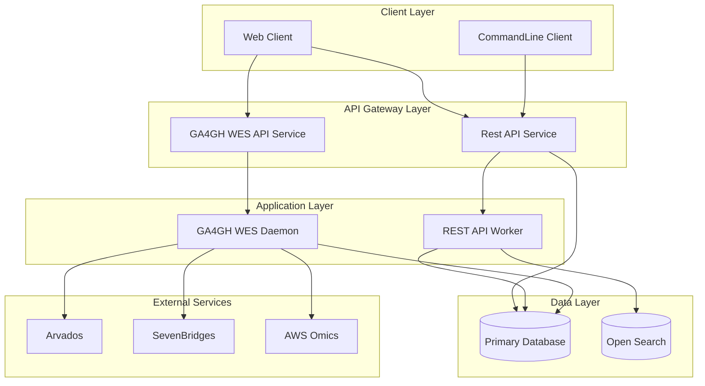
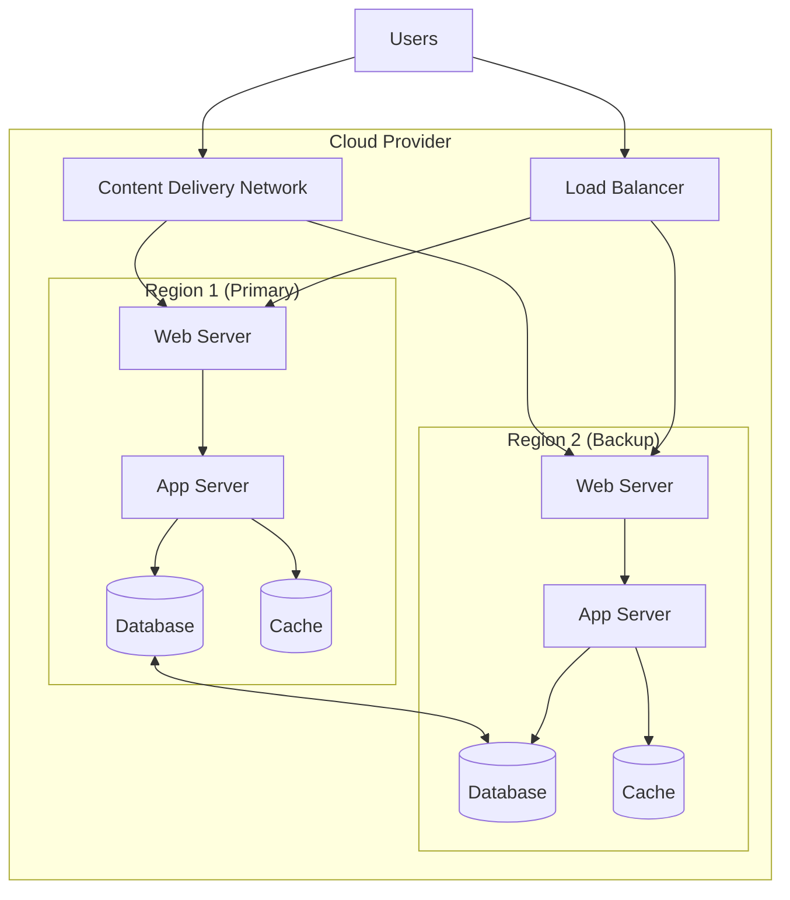
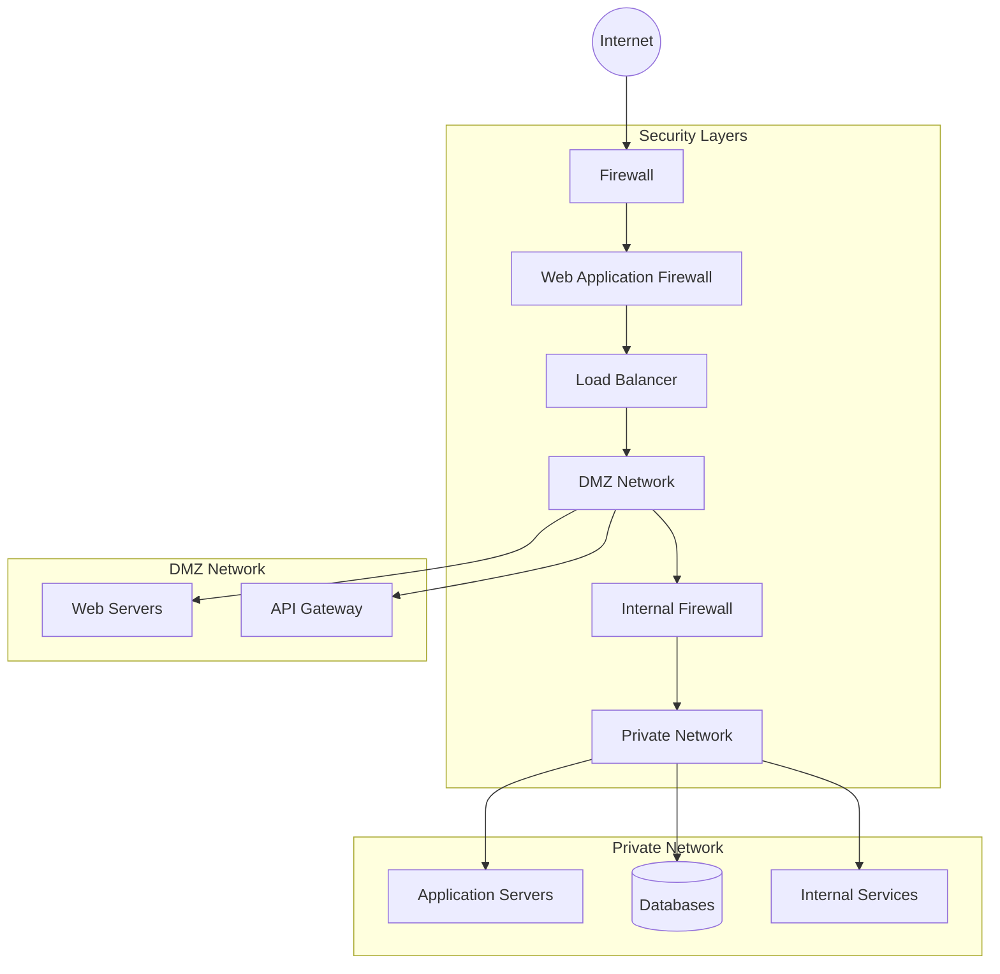

# Architecture Diagram

This document contains an architecture diagram for the project using Mermaid syntax. You can view this diagram in any Markdown viewer that supports Mermaid (like GitHub, VS Code with the Mermaid extension, or online Mermaid editors).

## System Architecture

## Component Details

### Client Layer
- **Web Client**: Browser-based interface for users
- **Mobile Client**: Native mobile applications (iOS/Android)
- **Third-Party Client**: External systems integrating with our API

### API Gateway Layer
- **API Gateway**: Central entry point for all client requests
- **Authentication Service**: Handles user authentication and authorization
- **Rate Limiting**: Controls request frequency to prevent abuse

### Application Layer
- **Service A**: [Describe main functionality]
- **Service B**: [Describe main functionality]
- **Service C**: [Describe main functionality]

### Data Layer
- **Primary Database**: Main data storage (e.g., PostgreSQL, MongoDB)
- **Cache System**: Fast access temporary storage (e.g., Redis)
- **File Storage**: Storage for documents, images, etc. (e.g., S3)

### External Services
- **Payment Provider**: Handles payment processing
- **Email Service**: Manages email communications
- **Analytics Service**: Collects and processes usage data

## Alternative Architecture Views

### Deployment View

### Security View

## How to Customize This Diagram

1. Replace the placeholder components with your actual system components
2. Adjust the relationships between components to match your architecture
3. Add or remove components as needed
4. Update the component descriptions with specific details about your system
5. Consider adding additional views (e.g., data flow, sequence diagrams) as needed

You can edit this Mermaid diagram using any text editor, and preview it using:
- VS Code with the Mermaid extension
- GitHub (which natively supports Mermaid)
- Online Mermaid editor: https://mermaid.live/
